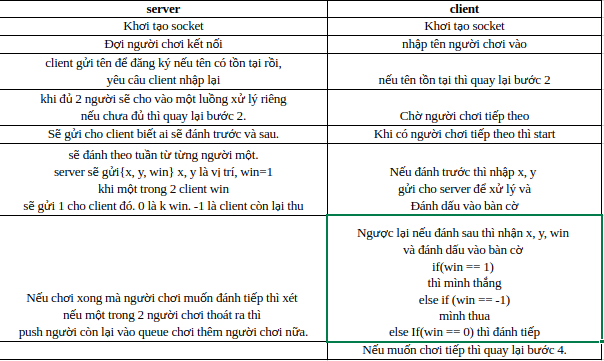

# Socket
## Run on windows
## C/C++
### *server - client*


# Use git
```
#clone ve 
git clone {link}
cd Caro

# Update code
git pull

# Switch another branch
git checkout development

# commit new code
git add .
git commit -m "Something"
git pull
git push origin development

```